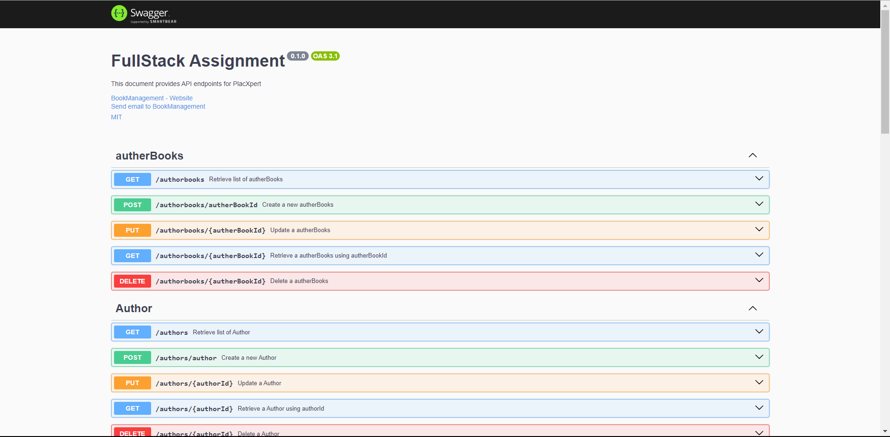

# FullStackAssignment
Assignment what I need to do you can find it here \
[Download PDF](https://drive.google.com/file/d/1m5e32Gs7A3TiM-Z5C0H9q6TNGLr7DaJD/view?usp=sharing)
## Follow the steps below to create a wokring server using Nodejs!

## Here is the Tree

```
┣ 📜.gitignore
┣ 📜app.js
┣ 📂config
┃ ┣ 📜database.js
┃ ┣ 📜swagger.config.const.js
┃ ┣ 📜swaggerConfig.js
┣ 📂controllers
┃ ┣ 📜autherBookController.js
┃ ┣ 📜authorController.js
┃ ┣ 📜bookController.js
┃ ┣ 📜customerController.js
┃ ┣ 📜orderController.js
┃ ┣ 📜orderItemController.js
┃ ┣ 📜userController.js
┣ 📜database.sql
┣ 📜index.js
┣ 📜logger.js
┣ 📂middlware
┃ ┣ 📜auth.js
┃ ┣ 📜request-logger.js
┣ 📂models
┃ ┣ 📜author.js
┃ ┣ 📜bookauthor.js
┃ ┣ 📜books.js
┃ ┣ 📜customer.js
┃ ┣ 📜orderItems.js
┃ ┣ 📜orders.js
┃ ┣ 📜user.js
┣ 📜now.json
┣ 📜package-lock.json
┣ 📜package.json
┣ 📜README.md
┣ 📂routes
┃ ┣ 📜authorbookRoutes.js
┃ ┣ 📜authorRoutes.js
┃ ┣ 📜bookRoutes.js
┃ ┣ 📜customerRoutes.js
┃ ┣ 📜indexRoute.js
┃ ┣ 📜orderitemRoutes.js
┃ ┣ 📜orderRoutes.js
┃ ┣ 📜userRoutes.js
┣ 📂utils
┃ ┣ 📜decodeToken.js
┣ 📜vercel.json
```
## Breif Overview of Project

So, basically, I had a problem statement that required me to build an online book management server. I had several technology options to choose from (Node.js, PHP, Spring Boot, Flask, Django, etc.), and I chose Node.js because it's not a very large server and contains only some basic features. Moreover, it can be enhanced in the future, making it a perfect choice for a microservices-based architecture.

Later on, the challenge was to assign permissions based on specific roles like customer and admin. To achieve this, I used the MVC architecture, which is ideal for handling services such as authentication, authorization, and various forms of validation, making the code more reusable rather than writing the same functions again and again. Additionally, I implemented middleware to ensure that only valid users can access the server.

To take this project to the next level, I plan to incorporate an API Gateway, which will further enhance the security of the application server. This will allow for more advanced security measures in the future.

Regarding the database, I opted for a relatively simple one. However, we can use a more structured database and enable all the necessary services. I have included the database schema and written it in the database.sql file. I have also written the scripts for both the database and schema, which are present in some files.

Moreover, the architecture I have used includes:

- `models`: Contains the access to the database and performs queries required based on the function calls.\
- `controllers`: Handle validation checks before performing queries in the database. They also generate login tokens and handle session storage.\
- `routes`: Contain the Swagger structure along with controller calls and middleware security.\
- `middleware`: Contains all the middlewares for authentication, logging, etc.\
- `utils`: Contains functions used repeatedly in different files and components, reducing the need to rewrite the same code.\
- `app.js`: The main file where all routes and security measures are called. It uses functions to implement sessions, Swagger, CORS, Helmet, etc.\
- `config`: Contains configurations for the database and Swagger UI.

## Running The Project Locally in your system
Clone the Project in your local system or you can download the zip file and can extract it

To clone -
```bash
$ git clone https://github.com/1rn19cs003/FullStackAssignment.git [folder_name_optional]
```

To run our application locally we need to execute the command below from the root folder of the project to install the required dependencies

```bash
npm install 
```
This should install the node_module package which has all the necessary packages to run the code
then to run your server you need to execute this command
```bash
$ npm start
```
This should launch a server at `http://localhost:{port}`. You may change port by modifying the value inside `.env`, which
I am assuming at PORT=3000.\
This should launch a new browser window with URL http://localhost:3000/. You'll see something similar as shown above.<br><br>

This should open a new browser window with the following message:
`Server is running at http://localhost:${PORT}/api/` where ${PORT} is set as an environment variable or defaulted to `3000`
```json
{"message":"Hello World!"}
```
The packages we has used in this project has been explained below to understand properly


# PS: If you have any suggestion about what can be improved please share your thoughts I would really appreciate that!

&nbsp;
&nbsp;


## Database
I have created a database schema, which is very basic. The primary motive was to create a server with features like authentication, authorization, error handling, and a logger to track API requests and responses. Currently, I am displaying these logs in the terminal. However, we can connect it to a database to store and track them. Additionally, one can create a trigger query to clean the old logs periodically

Database Schema can be seen here how I approached based on the problem statement 
[Database schema](https://dbdiagram.io/d/assignment-6511f074ffbf5169f0794181)

The Database is used in this project is Postgres SQL and can be connected easily with nodejs using some bunch of code which is written below.


```JavaScript

const { Pool } = require('pg');
require('dotenv').config();

const pool = new Pool({
    connectionString: process.env.POSTGRES_URL + "?sslmode=require",
})


/*
We can use normal try and catch block but in postgress
there is one problem while working with online-databse that it 
mighth try to reconnect if you are not using your server 
so to prevent from that we again and agin try to connect in config file 
to aviod any Miss operations of Query
*/

const connectWithRetry = () => {
    console.log(`Connecting to the database...${process.env.PORT}`);
    // ${process.env.POSTGRES_URL}`
    pool.connect((err, client, release) => {
        if (err) {
            console.error('Database connection error:', err);
            setTimeout(connectWithRetry, 5000); // Retry after 5 seconds
        } else {
            // console.log(client);
            console.log('Connected to the database');
            release(); // Release the connection
        }
    });
};

connectWithRetry();


module.exports = pool;

```
You need to specify the `port` name that's it in your `.env` file and then it'll start working

# API Documentation
The API is documented using [Swagger UI Express](http://ec2-34-238-39-43.compute-1.amazonaws.com:3000/api-docs/#/).


All the endpoints are given in the swagger UI which was my motive to use the Swagger

The generated docs will look like this :
The swagger Screen shots have been attached you can see that .


If you want to test it out using [Postman](https://www.postman.com/), make sure your request has an **Authorization** header
If you see that, then congratulations 🎉🎊 You have successfully started your first Node Express Application Specification.
If you see that, then congratulations - your local environment is working correctly and ready for use.

    

## Nodejs server built and maintained by [Abhishek Jaiswal ](https://www.linkedin.com/in/abhishekjaiswal1308/)


## `*************************************************************`

## In order to create your own web server:

## Navigate the cursor to the file I will create the project in the terminal and I am creating the package.json file with the following command:

```
npm init --y
```

## Now let’s add the packages that are necessary to create the server and its purpose:

- **body-parser**: Middleware for parsing HTTP request body data.

- **colors**: A library for adding color to console logs (mostly for development/debugging).

- **connect-redis**: A Redis session store for Express sessions.

- **cookie-parser**: Middleware for parsing cookies from incoming HTTP requests.

- **cookie-session**: Middleware for handling session cookies.

- **cors**: Middleware for handling Cross-Origin Resource Sharing (CORS) in Express applications.

- **dotenv**: Loads environment variables from a `.env` file into `process.env`.

- **eslint**: A tool for identifying and fixing problems in JavaScript code.

- **express**: A web framework for building web applications and APIs in Node.js.

- **express-session**: Middleware for handling sessions in Express applications.

- **fs**: The built-in Node.js file system module for interacting with the file system.

- **helmet**: A collection of middleware for securing Express apps by setting various HTTP headers.

- **jsonwebtoken**: A library for creating and verifying JSON Web Tokens (JWTs) for user authentication.

- **morgan**: Middleware for logging HTTP requests and responses in Express.

- **node**: This appears to be a placeholder or typo as it's not a valid npm package.

- **nodemon**: A utility that monitors for changes in your Node.js application and automatically restarts the server.

- **passport**: An authentication middleware for Node.js.

- **passport-local**: A Passport strategy for authenticating with a username and password.

- **pg**: A PostgreSQL client for Node.js.

- **pg-hstore**: A module for serializing and deserializing JSON data to hstore format in PostgreSQL.

- **sequelize**: An Object-Relational Mapping (ORM) library for working with SQL databases in Node.js.

- **swagger-jsdoc**: A tool for generating Swagger documentation from JSDoc comments in your code.

- **swagger-ui-express**: Middleware for serving Swagger UI to visualize and interact with your API documentation.

- **ts-node**: A TypeScript execution environment and REPL for Node.js.

- **ts-node-dev**: A TypeScript development server with fast restarts and enhanced type checking.

- **typescript**: A superset of JavaScript that adds static types to the language.

- **winston**: A logging library for Node.js applications.

- **winston-daily-rotate-file**: A transport for rotating log files daily when using the Winston logger.


To install the necessary packages, run the following commands:

```bash
npm install body-parser colors connect-redis cookie-parser
npm install cookie-session cors dotenv eslint express
npm install express-session helmet jsonwebtoken morgan
npm install passport passport-local pg pg-hstore sequelize
npm install swagger-jsdoc swagger-ui-express ts-node ts-node-dev
npm install typescript winston winston-daily-rotate-file
```


## And finally, let’s add the following code to scripts field in the package.json file.

```
"start": "nodemon index.js"
```

### If you don’t have nodemon in your PC, I advise installing it globally.

```
sudo npm install -g nodemon
```

## Adding Swagger to the project

Firstly, let’s install two modules that are necessary for documentation and user interface (UI):

```
npm install swagger-jsdoc swagger-ui-express
```

## And I am importing these two modules in the app.js file:

```JavaScript
const swaggerUi = require("swagger-ui-express");
const swaggerJsdoc = require("swagger-jsdoc");
```

The important this you need to add for swagger is some couple of codes to mkae the UI work.
```JavaScript
// Import the 'swagger-jsdoc' library to generate Swagger documentation.
const swaggerJsdoc = require('swagger-jsdoc');

// Define Swagger options for generating API documentation.
const options = {
    // Define the API information.
    definition: {
        openapi: "3.0.0", // Specify the OpenAPI version.
        info: {
            title: "Library API", // API title.
            version: "1.0.0", // API version.
            description: "A simple Express Library API", // API description.
            termsOfService: "http://example.com/terms/", // Terms of service URL.
            contact: {
                name: "Abhishek Jaiswal", // Contact name.
                url: "https://www.linkedin.com/in/abhishekjaiswal1308/", // Contact URL.
                email: "abhigrmr@gmail.com", // Contact email.
            },
        },
        // Define the server where the API documentation is hosted.
        servers: [
            {
                url: "https://full-stack-assignment-gamma.vercel.app/", // Base URL of the API.
                description: "My API Documentation", // Description of the server.
            },
        ],
    },
    // Specify the files to scan for API endpoints.
    apis: ['./routes/*.js'], // Scan all JavaScript files in the 'routes' directory.
};

// Generate the Swagger specification using the defined options.
const specs = swaggerJsdoc(options);

// Export the Swagger specification for use in the application.
module.exports = specs;

```

Import the above code into your app.js file

Then based on your requirements start the code.❤️
